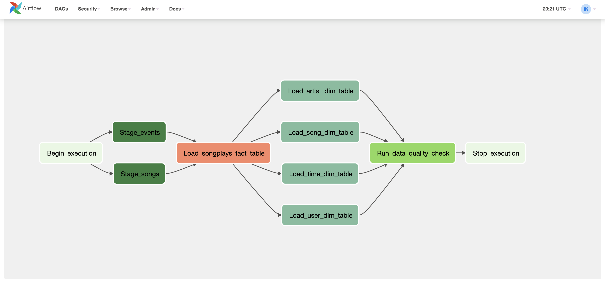

# Project: Airflow ETL - S3 to Redshift

This project was completed on 19th August 2021.

## Introduction

A startup called Sparkify wants to analyze the data they've been collecting on songs and user activity on their new music streaming app. 

All their data is stored in JSON files in AWS S3 buckets. The requirement is to setup an Airflow DAG which runs hourly and extract their
log and songs data stored in S3, stages it in Redshift, and then creates analytical tables based on that data.

## Quick Start Guide

1. Ensure Python 3.6+ is installed
2. Ensure that pipenv is installed ```https://pypi.org/project/pipenv```
3. Ensure that Airflow is installed locally
4. Clone the repo: ```git clone https://github.com/aivoric/Data-Engineering-ND-Airflow-Project-5```
5. Enter the downloaded folder and install dependencies using pipenv: ```pipenv install```
6. Activate the virtual environment ```pipenv shell```
7. Run your Airflow web server ```airflow webserver --port 8080```
8. Run your Airflow scheduler server ```airflow scheduler```

Important: Make sure the cloned repo with the DAG is on a path which is recognised by Airflow so that it picks up the DAG.
Usually your AIRFLOW_HOME environment variable dictates where Airflow will check for DAGs. You might want to move your cloned
DAG there.

## Notes on Files and Folders

```airflow/dags/sparkify_dag.py``` contains the main and only DAG for this project.

```airflow/dags/operators``` folder containing all the custom operators.

```airflow/dags/sql``` folder containing all the sql statements for inserting data, dropping tables, and creating tables.


## A note on Upserts into Redshift

The songplays Operator has been designed to support upserts. 

Upserts can be performed in Redshift, but are slightly tricky because Redshift is columnar storage database. Check the guide here:
https://docs.aws.amazon.com/redshift/latest/dg/merge-replacing-existing-rows.html

The way upserts are handled in this ETL is the following:
1. A SQL procedure is created (can be found inside the load_fact.py operator) which does the tasks outlined in the link above.
2. The procedure is then called and it completes various tasks, including the creation of a temporary staging table.

## Handling Duplicates

For tables created based on the SONG staging data this is done simply by doing a GROUP BY on a DISTINCT column.

For the ```users``` table it's slightly more tricky since we are reading from the EVENTS staging data and we are only interested in the latest events from the user, and hence we would take the users metadata from that. This is solved via an INNER JOIN:

```
user_table_insert = ("""
    INSERT INTO users(
        SELECT
            a.user_id
            , a.first_name
            , a.last_name
            , a.gender
            , a.level
        FROM staging_events a
        INNER JOIN (
            SELECT user_id, MAX(ts) as ts
            FROM staging_events
            GROUP BY user_id
        ) b ON a.user_id = b.user_id AND a.ts = b.ts
        )
""")
```

An technical explanation about the above can be found here:
https://stackoverflow.com/questions/121387/fetch-the-row-which-has-the-max-value-for-a-column


## Preview of how the DAG looks like in the Airflow UI:


